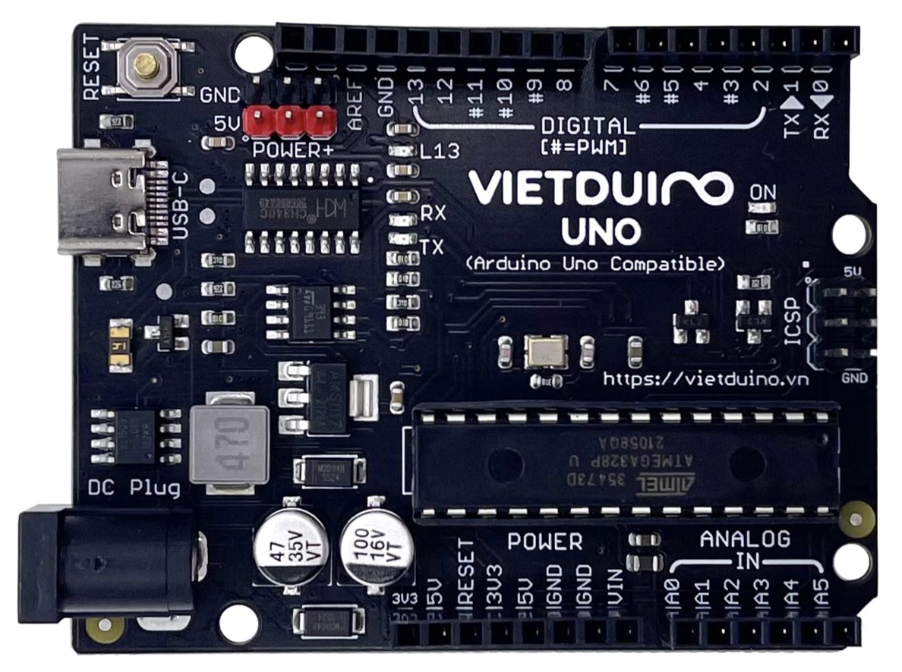

# Vietduino Uno USB Type - C (Arduino Uno Compatible)

## Giới thiệu

Mạch Vietduino Uno (Arduino Uno Compatible) được nghiên cứu và và sản xuất bởi MakerLab.vn dựa trên nguyên mẫu là mạch Arduino Uno với các ưu điểm vượt trội:

1. Thiết kế tương thích hoàn toàn về hình dạng, chuẩn chân tín hiệu và cách sử dụng với Arduino Uno.
2. Sử dụng mạch nguồn xung giảm áp với ưu điểm là hiệu suất chuyển đổi cao, toả nhiệt thấp, tiết kiệm năng lượng, dải điện áp đầu vào cấp cho mạch rộng từ 6~24VDC với dòng đầu ra lớn: 5VDC/Max 1500mA, 3.3VDC / Max 700mA.
3. Bổ sung thêm các chân cấp nguồn POWER+ 5VDC giúp dễ dàng cấp nguồn cho nhiều thiết bị khác nhau.
4. Sử dụng IC chuyển đổi USB-UART CH340 được nhập khẩu chính hãng cho độ ổn định và độ bền cao.
5. Chức năng cách ly nguồn cổng USB tự động khi cấp nguồn ngoài từ chân Vin hoặc giắc DC giúp bảo vệ cổng USB máy tính của bạn an toàn hơn.

## Thông số kỹ thuật

- **Model**: Vietduino Uno (Arduino Uno Compatible)  
- **Vi điều khiển**: ATmega328P-PU  
- **Điện áp hoạt động**: 5VDC  
- **Điện áp đầu vào VIN**: 6~24VDC  
- **Dòng DC đầu ra các chân I/O**: Max 20mA  
- **Dòng DC đầu ra chân 3V3**: Max 700mA  
- **Dòng DC đầu ra chân 5V**: Max 1500mA  
- **Flash Memory**: 32KB với 0.5 KB sử dụng cho bootloader  
- **SRAM**: 2KB  
- **EEPROM**: 1KB  
- **Clock Speed**: 16MHz  
- **IC nạp chương trình và giao tiếp UART**: CH340  
- **Cổng giao tiếp máy tính**: USB-C  
- **Kích thước**: 68.6 x 53.34mm  

## Hình ảnh sản phẩm




## Kích thước sản phẩm


## Các chân tín hiệu

- **Digital I/O**: 14 chân (với 6 chân có chức năng PWM)  
- **PWM Digital I/O**: 6 chân (D3, D5, D6, D9, D10, D11)  
- **Analog Input**: 6 chân (A0~A5)  
- **LED_BUILTIN**: D13  

## Hướng dẫn sử dụng với phần mềm Arduino

### Hướng dẫn sử dụng phần mềm Arduino cơ bản

1) Giới thiệu về Arduino
2) Ngôn ngữ lập trình Arduino
3) Cách cài đặt phần mềm Arduino IDE
4) Cách cài đặt Driver và nạp chương trình cho mạch Arduino / Arduino Compatible
5) Cách cài đặt các thư viện phần cứng Arduino Library
6) Cách sử dụng Serial Monitor & Serial Plotter trên phần mềm Arduino

### Hướng dẫn kết nối và nạp chương trình cho Mạch Vietduino Uno trên phần mềm Arduino

1) **Kết nối máy tính**: Kết nối Mạch Vietduino Uno với máy tính bằng cáp USB sẽ thấy Led nguồn ON trên mạch **phát sáng**:

[]()

2) **Cài đặt Driver**: Mạch Vietduino Uno mà một mạch Arduino Uno Compatible (tương thích Arduino Uno) sử dụng IC nạp chương trình và giao tiếp máy tính CH340, các bạn có thể tham khảo Hướng dẫn cài đặt Driver cho các mạch sử dụng IC giao tiếp USB-UART CH34x - MakerLab Wiki.
3) **Cấu hình mạch trên phần mềm Arduino**: Để cấu hình mạch trên phần mềm Arduino chúng ta cần làm các bước sau:

     Thiết lập Board tại **Tools > Board > Arduino AVR Boards > Arduino Uno và Port (cổng kết nối) cho mạch**, nếu không xác định được cổng kết nối có thể ngắt kết nối mạch và kết nối lại đồng thời kiểm tra phần Port để thấy cổng kết nối mới của mạch xuất hiện:  

[]()

Sau khi đã hoàn thành các thiết lập cơ bản bạn có thể nạp chương trình **Blink** sau vào mạch để test bằng cách nhấn vào nút **Upload** hoặc chọn **Sketch > Upload** sẽ thấy Led được kết nối với chân D13 trên mạch chớp tắt **1 giây 1 lần**:<br>

```ino
/*
  Blink
  Turns an LED_BUILTIN on D13 of Vietduino Uno for one second, then off for one second, repeatedly.
*/
// the setup function runs once when you press reset or power the board
void setup() {
  // initialize digital pin LED_BUILTIN on D13 as an output.
  pinMode(13, OUTPUT);
}

// the loop function runs over and over again forever
void loop() {
  digitalWrite(13, HIGH);  // turn the LED on (HIGH is the voltage level)
  delay(1000);                      // wait for a second
  digitalWrite(13, LOW);   // turn the LED off by making the voltage LOW
  delay(1000);                      // wait for a second
}
```

[]()

## Hỗ trợ và liên hệ

- Website: [https://www.makerlab.vn/](https://www.makerlab.vn/)
- Facebook: [https://www.facebook.com/makerlabvn](https://www.facebook.com/makerlabvn)

## Nhà phân phối

- Các bạn có thể mua sản phẩm của MakerLab tại các [Nhà Phân Phối.](https://www.makerlab.vn/distributor/)
